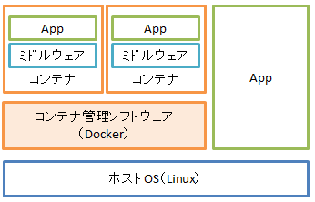
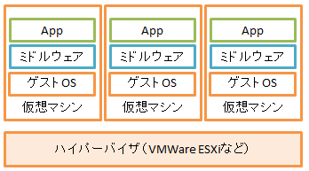
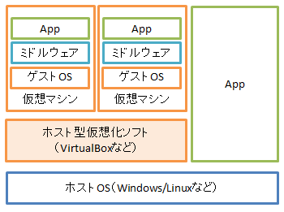

# KVM#section01 : KVMとは

# 簡単な仮想化技術の紹介

KVMについての説明をする前に，仮想化技術にはどんなものがあるのか  
触れておきたいと思います．  
Vagrant入門講座でも簡単に説明しましたが，ここでももう一度説明しておきます．  
Vagrantさえ知ってれば良くない？と思うかもしれませんが，  
Vagrantはあくまで仮想化ソフトのラッパーツールなので，  
元になる仮想化ソフトについて知っておいた方が後々応用が効きます．
今回ここで話題にする仮想化技術とは，サーバ仮想化・プラットフォーム仮想化を指します．

仮想化ソフトウェアには，大きく分けるとType1ハイパーバイザとType2ハイパーバイザが存在します．

## Type1ハイパーバイザ

Type1ハイパーバイザは更にパーティショニングタイプとハイパーバイザタイプに分けられます．  

### パーティショニングタイプ

パーティショニングタイプは俗にコンテナ型仮想化ソフトウェアと呼ばれるものになります．  
このタイプは，chrootが源流といわれており，  
ハードウェアで仮想化を実現するもので，ハードウェアを論理的に分割して，  
1つの物理マシンで複数のOSが起動しているように見せかけることが出来ます．  
ハードウェアそのものを分割して共通のカーネルを利用しているので  
提供されるアーキテクチャが単一のものになるのが特徴です．  
また，仮想マシンをエミュレートしないため，起動が早く動作が軽い傾向にあります．  
Dockerなどがあります．

- 他のソフト

  
[Dockerではじめるコンテナ型仮想化環境](http://www.devlog.atlas.jp/2015/01/29/450)より引用

### ハイパーバイザタイプ

ハイパーバイザタイプは，ソフトウェアで仮想化を実現します．  
管理OSは必要としますがソフトウェア自体はハードウェア上で動作でするため，
ホストOSでの処理は挟みません．  
パーティショニングタイプと比べると格段に処理が遅くなる傾向にありますが，  
異なるアーキテクチャを利用出来ます．  
ホストOSでの処理を挟まないので，下の項で紹介するType2ハイパーバイザよりも  
動作が早い場合が多いです．  
KVMはLinuxにハイパーバイザの機能を組み込むものなので，ここに属していると言えます．
他にもVMware vSphere, Xen, Hyper-Vなどがあります．

  
[Dockerではじめるコンテナ型仮想化環境](http://www.devlog.atlas.jp/2015/01/29/450)より引用

## Type2ハイパーバイザ

Type2ハイパーバイザは，ホスト型仮想化ソフトウェアの別称です．  
Virtual BoxやVMWare Workstation, QEMUなどがここに属します．  
ホストOSの上でアプリケーションとして動作します．  
手軽に使えるため，開発やテストのために複数のOSを使いたいときなどに使われることが多いです．  
一方で，ホストOSを通してハードウェアを操作する必要があるため，  
Type1ハイパーバイザと比べるとオーバーヘッドが大きくなってしまい，  
サーバとして利用されることは少ないと言われています．

  
[Dockerではじめるコンテナ型仮想化環境](http://www.devlog.atlas.jp/2015/01/29/450)より引用

# KVMのタイプ

さて，KVMはLinuxにハイパーバイザの機能を組み込むため  
Type1のハイパーバイザタイプに属すると書きました．  
仮想マシンの構築はカーネルモジュールとして提供していますが，  
仮想マシンとのやり取りはホスト型のソフトウェアであるQEMUを利用しています．  
そのため，単純に上記の2タイプに分けることは難しいです．  
KVM自体が新しいソフトウェアであるため，旧来のカテゴリのままには分類出来ないようです．  
仮想化基盤自体はハイパーバイザとして実装されているため，  
ハイパーバイザ型仮想化ソフトウェアと言われることが多いようです．

# それぞれのタイプの使い所

## コンテナ型

起動の早さが他のタイプと比べて段違いです．数秒で起動します．  
反面単一のプロセスしか稼働出来ません．  
同じサービスのミラーを作って負荷分散したり，  
複数のサービスを安全に同一サーバ上で動かしたり，  
Blue Green Deploymentを行いたいときに使うことになると思います．

## ハイパーバイザ型

コンテナ型ほどの速度では起動できませんが，ホスト型よりは早く起動できます．  
それぞれ全く別のOSを起動できるので，様々な用途で使うことができます．  
常に起動するサーバなどを構築されるために使われることが多いようです．

## ホスト型

ホストOSを経由することから発生するオーバーヘッドがあるため，  
他の2つのタイプと比べるともっとも動作が重いとされています．  
すでに利用しているPCにも簡単に入れることができるので，  
ちょっと動作を確認したいときや，普段使っているWindowsなどでLinux環境で  
開発したい時に使われます．

KVMはハイパーバイザ型の動作性を持ちつつ，ホスト型の手軽さを備えているソフトウェアと言えます．  

続いて，コマンドラインでKVMによる仮想マシン構築を試してみましょう．

# 参考資料

- [KVM徹底入門](http://www.shoeisha.co.jp/book/detail/9784798121406)  
[Dockerではじめるコンテナ型仮想化環境](http://www.devlog.atlas.jp/2015/01/29/450)より引用

---

次のセクション [section02 : virshによる仮想マシン構築](./Usevirsh.md) へ進む.  
[README](./README.md) に戻る．
