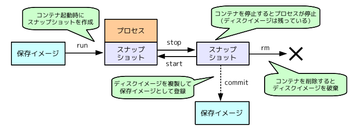

# Docker#section06 : コンテナのライフサイクル

- docker run でコンテナ生成&コンテナ起動
- docker stop でコンテナ停止
- docker start でコンテナ起動
- docker attach で起動しているコンテナに接続
- docker rm でコンテナ削除

[Dockerにおけるコンテナのライフサイクル](http://enakai00.hatenablog.com/entry/20140628/1403933390)より引用

---

次のセクション [section07 : DockerでApacheを起動してみよう](./StartApache.md) へ進む.  
[README](./README.md) に戻る．
